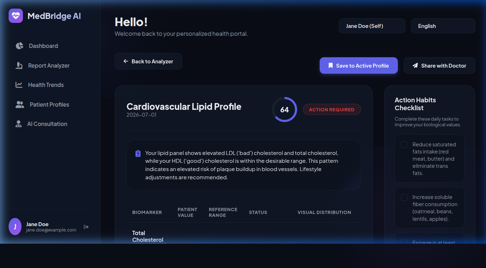
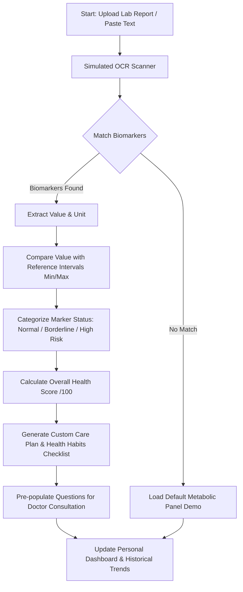
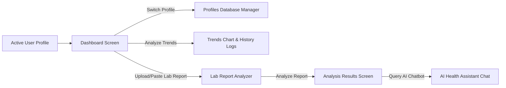

# 🏥 MedBridge AI — Personal Medical Report Analyzer & Health Tracker



MedBridge AI is a state-of-the-art, client-side web application designed to empower patients by breaking down complex medical laboratory reports into clear, understandable, and actionable insights. Built with a multilingual focus supporting **7 languages**, it serves as a bridge between professional lab data and personal health management.

---

## 🚀 Live Demo & Key Workflows



---

## ✨ Features

- **📂 Simulated OCR Lab Report Scanner & Raw Text Analyzer**
  Scan files (PDFs/Images) or paste raw text reports. The matching engine identifies biomarkers like Glucose, LDL Cholesterol, HDL Cholesterol, Triglycerides, WBC, RBC, Hemoglobin, Creatinine, TSH, and more.
- **📊 Interactive Visual Dashboard**
  View high-level health scores, active health alerts, daily habit checklist progress, and access a chronologically ordered history of previous reports.
- **🧭 Biomarker Range Visualizers & Tooltips**
  Every lab value is represented visually against its clinical reference intervals using sliding range indicators. Interactive glossary tooltips explain medical jargon in layperson terms.
- **📈 Historical Trend Charts**
  Analyze and visualize health improvements over time using dynamic multi-metric charts (powered by Chart.js) and enter manual logs for blood metrics.
- **👥 Multi-Profile Database Manager**
  Manage medical files and progress logs separately for multiple family members (e.g., Self, Spouse, Children) under a unified account.
- **🤖 Simulated AI Health Chat Assistant**
  Converse with a dedicated health chatbot initialized with context from your latest lab results. Disclaimer notices ensure guidelines are followed.
- **🌐 7-Language Complete Localization**
  Fully translated UI interfaces, glossaries, summaries, and action plans in:
  - English (EN)
  - Spanish (ES)
  - French (FR)
  - Arabic (AR - with Full RTL support)
  - Hindi (HI)
  - Telugu (TE)
  - Tamil (TA)

---

## 🛠️ Technology Stack

- **Frontend & UI Layout**: Semantic HTML5, Custom Responsive CSS3 Variables (sleek dark mode layout with interactive accents).
- **Core Controller Logic**: Pure Vanilla JavaScript (ES6+), object-oriented mock database structure.
- **Charts & Data Visualizations**: [Chart.js](https://www.chartjs.org/) via CDN.
- **Icons**: FontAwesome 6.4.0.
- **Typography**: Inter (Google Fonts).
- **State Management & Persistence**: Client-side storage (`localStorage`) for instant reload and persistence.

---

## 🗺️ Application Screen Architecture



---

## 💻 Local Development Setup

No complex build steps or dependencies are needed to run the project.

1. **Clone or Download** the files into a local folder.
2. **Open index.html** directly in any modern web browser, or run a local server:
   ```bash
   # Using python
   python3 -m http.server 8000
   
   # Or using Node.js
   npx serve .
   ```
3. Open `http://localhost:8000` (or the port specified) in your browser.
4. **Log In** with the preconfigured test user:
   - **Email**: `jane.doe@example.com`
   - **Password**: `password123`

---

## ⚠️ Disclaimer

MedBridge AI is designed strictly for informational and educational support. This system does not deliver clinical diagnoses, medical treatments, or prescriptions. Always cross-reference AI recommendations and lab thresholds with a licensed healthcare physician.
